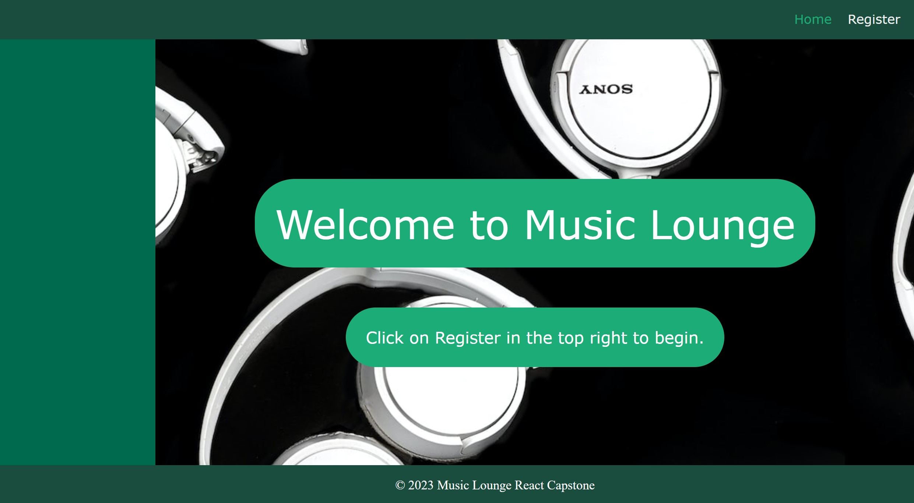
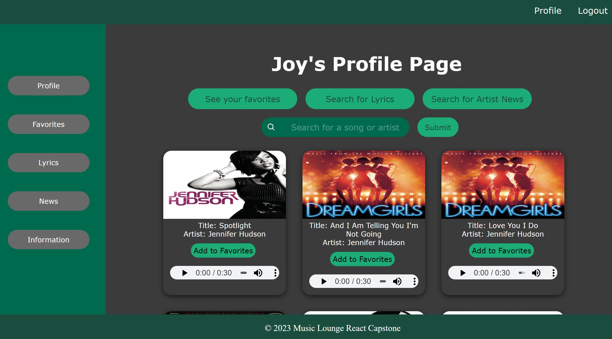
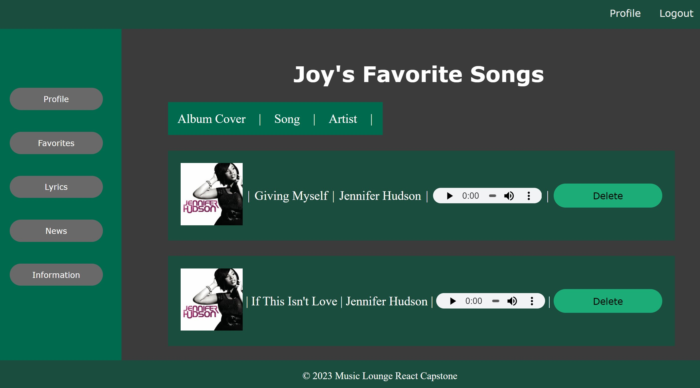
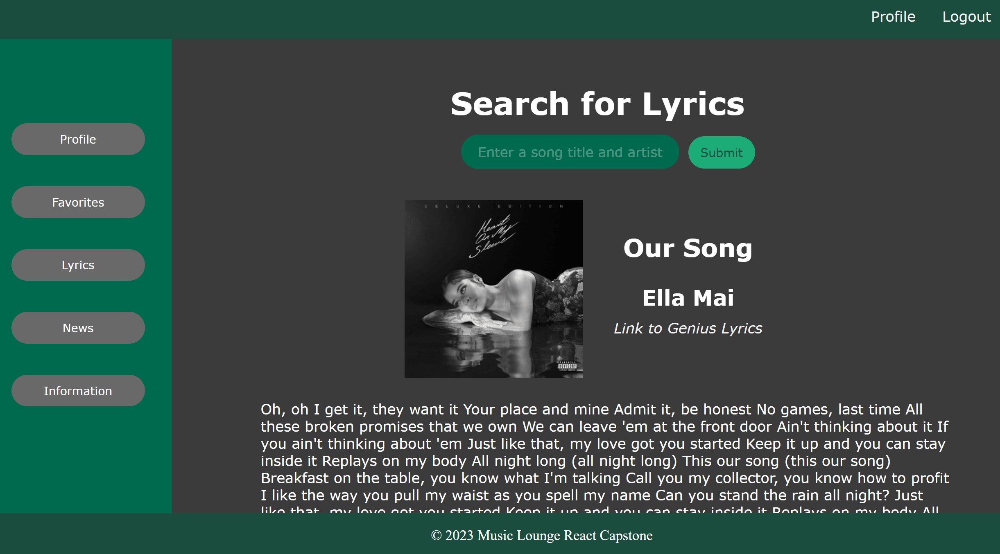
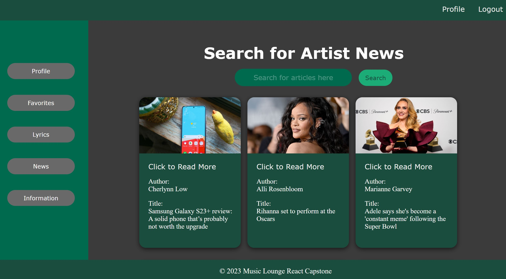

# Music-Lounge-Capstone

[](https://nodejs.org/en/)
[](https://reactjs.org/)
[](https://react-redux.js.org/)

[](https://www.javascript.com/)
[](https://opensource.org/licenses/Unsplash)
[](https://github.com/JoyUmoekpo/Music-Lounge-Capstone/commit/main)

## Description
Welcome to Music Lounge!

Have you been looking for a seemless platform to search for music, song lyrics, and artists? Well, I present you with Music Lounge! In addition to all these features, Music Lonuge also allows users to search for and favorite songs that they may not be able to find on other music applications.

I chose to build Music Lounge because I wanted to create an application that could search a large library of music and allow users to add songs to a personalized favorites list including songs they may not be able to find on other applications.

## Table of Contents
* [Technologies Used](#technologies-used)
* [Respoitory Link](#repository-link)
* [Features](#features)
* [Future Developments](#future-developments)
* [Application Images](#application-images)
* [Contributing](#contributing)
* [Tests](#tests)
* [Questions](#questions)
* [Credits](#credits)
* [License](#license)

## Technologies Used
* HTML
* CSS
* JSX
* Node.js
* React
* Redux
* JSON Web Tokens
* Sequelize
* Bit.io
* Express
* Axios
* Cors
* JSON
* Unsplash


## Repository Link
* This is the repository link for this application: [Music Lounge Repository](https://github.com/JoyUmoekpo/Music-Lounge-Capstone)

## Features
* Users can login and logout of the application.
* Users can search for songs.
* Users can favorite songs and remove songs from their favorite lists.
* Users can search for song lyrics.
* Users can search for news related to music artists.

## Future Developments
* The ability to create playlists
* The ability to search for upcoming artist events

## Application Image(s)






## Contributing
* I'm open to contributions!

## Tests
* No tests were preformed.

## Questions
If you have any questions, feel free to contact me by using the information listed below:

* Github: https://github.com/joyumoekpo
* LinkedIn: https://www.linkedin.com/in/joyumoekpo/

## Credits
* Unsplash: https://unsplash.com/photos/O4vWR6kqN8U

## License
### Unsplash License

```
Unsplash photos are made to be used freely. Our license reflects that.

All photos can be downloaded and used for free
Commercial and non-commercial purposes
No permission needed (though attribution is appreciated!)
```
